# One Double
🎨 One Double color scheme

Based on [One Half](https://github.com/sonph/onehalf) color scheme which is based on Atom's [One Dark](https://github.com/atom/one-dark-syntax) and [One Light](https://github.com/atom/one-light-syntax) themes.

## Screenshots

### Dark

### Light

## Installation

### macOS / iTerm2

* Download and install the [One Double](./assets/One%20Double.itermcolors) iTerm colors file.
